**1.** npm init - y -->comando de node.js que nos permite crear un documento package.json, donde vamos a poder listar sentencia y algunos scripst.

```
{
  "name": "project_express_sequelize_postgres",
  "version": "1.0.0",
  "description": "",
  "main": "index.js",
  "scripts": {
    "test": "echo \"Error: no test specified\" && exit 1"
  },
  "keywords": [],
  "author": "",
  "license": "ISC"
}
```

**2.** Instalar modulos o dependencias de produccion.

- npm install express --save
- npm install morgan --save
- npm install --save sequelize
- npm install --save pg pg-hstore
- npm install bcrypt
- npm install nodemon
- npm install dotenv --save

**3.** Creamos el documento .env de variables de entorno dentro de la carpeta raiz.

**4.** Creamos el .gitignore, para no subir al repositorio remoto node_models y package-lock.json

**5.** Creamos una carpeta src y dentro index.js y app.js --> donde el index.js sera el encargado de arrancar la aplicacion y app.js tendra la configuracion de express

index.js

```
const server = require("../src/app");
require("dotenv").config();
const port = process.env.PORT;
server.listen(port, () => {
  console.log(`use port ${port}`);
});
```

app.js

```
const express = require("express");
const app = express();
module.exports = app;
```

viendo la terminal -->

```
[nodemon] restarting due to changes...
[nodemon] starting `node src/index.js`
use port 3000
```

**6**. Creamos una carpeta llamada database -->realizaremos la conseccion de sequelize.

**7.** Creamos una carpeta llamada routes --> donde guardaremos nuestras rutas del servidor. Es decir url que nuestros clientes van a poder pedir ejemplo un /products /categories en este caso vamos a crear dos rutas un /proyect y /ask.

**8.** Creamos una carpeta que se llama controllers --> que van a ser las fucniones que se guardaran en las rutas.

**9.** Creamos la carpeta models --> En esta carpeta van a quedar los datos que iremos guardando en nuestra base de datos. Es decir vamos a definir las tablas que se van a crear en la base de datos.

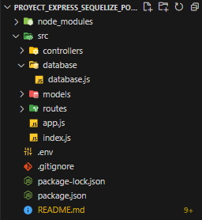

**10.** Creamos un documento dentro de database con el mismo nombre database.js

```
const Sequelize = require("sequelize");

const sequelize = new Sequelize("proyectDB", "postgres", "Esteban2212", {
  host: "localhost",
  dialect: "postgres",
});

module.exports = sequelize;
```

**11.** Nos dirigimos al index.js e importamos sequelize

```
const server = require("../src/app");

require("dotenv").config();
const sequelize = require("../src/database/database");
const port = process.env.PORT;

const main = async () => {
  try {
    await sequelize.authenticate();
    server.listen(port, () => {
      console.log(`use port ${port}`);
    });
    console.log("Connection has been established successfully.");
  } catch (error) {
    console.error("Unable to connect to the database:", error);
  }
};

main();
```

Respuesta -->

```
[nodemon] starting `node src/index.js`
[nodemon] clean exit - waiting for changes before restart
[nodemon] restarting due to changes...
[nodemon] starting `node src/index.js`
Executing (default): SELECT 1+1 AS result
Connection has been established successfully.
use port 3000
```

**12.** Analizamos el Modelo Entidad Relación.
**Modeling**

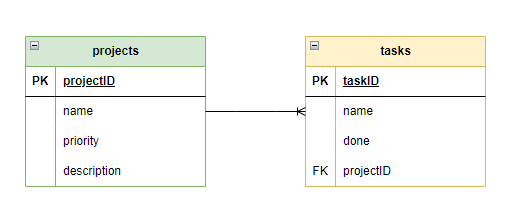

Vamos a crear dos tablas, la relacion es de uno a muchos.

- Una tabla llamada projects y una tabla llamada tasks
- La tabla projects va a contener muchas tareas.
- Cada proyecto va a contener un id.
- En la tabla projects va a tener una priority que va a ser un número. -->Es para saber la prioridad del projects
- Va a contener una descripcion para saber de que se trata el projecto.
- Tambien en la tabla de tasks, va a contner una propiedad llamada done, donde es un boolean y veremos si la tarea ya fue o no realizada. Por defecto cada tarea va a iniciar en false, ya que si la añadimos es por que no se ha realizado la tarea.
- Cada una de esas tasks va a pertenecer a un proyecto en específico con su id personal.

**13.** A continuacion vamos a la carpeta Models donde empezaremos a construir las tablas y crearemos los dos archivos .js Project.js --> nos va a servir para modelar las tablas de projects. Y creamos el de Task.js

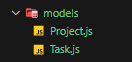

- Importamos DataTypes --> trae los tipos de datos que soporta sequelize.
- Importamos la conexion a la base de datos.

**Modelo de project**
--> Con esto tenemos definido nuestro esquema de projecto pero necesito crear una tabla a partir de este esquema.

```
const { DataTypes } = require("sequelize");
const sequilize = require("../database/database");

const Project = sequilize.define("projects", {
  projectID: {
    type: DataTypes.INTEGER,
    primaryKey: true,
    autoIncrement: true,
  },
  name: {
    type: DataTypes.STRING,
  },
  priority: {
    type: DataTypes.INTEGER,
  },
  description: {
    type: DataTypes.STRING,
  },
});

module.exports = Project;

```

- Vamos al index.js e importamos el esquema para que javascript sepa que lo estoy utilizandolo. Y agregamos la sincronizacion de sequelize.sync()

```
const server = require("../src/app");
const project = require("../src/models/Project");

require("dotenv").config();
const sequelize = require("../src/database/database");
const port = process.env.PORT;

const main = async () => {
  try {
    await sequelize.authenticate();
    await sequelize.sync();
    server.listen(port, () => {
      console.log(`use port ${port}`);
    });
    console.log("Connection has been established successfully.");
  } catch (error) {
    console.error("Unable to connect to the database:", error);
  }
};

main();
```

Y nos muestra en la terminal lo siguiente -->

```
[nodemon] restarting due to changes...
[nodemon] starting `node src/index.js`
Executing (default): SELECT 1+1 AS result
Executing (default): SELECT table_name FROM information_schema.tables WHERE table_schema = 'public' AND table_name = 'projects'
Executing (default): SELECT i.relname AS name, ix.indisprimary AS primary, ix.indisunique AS unique, ix.indkey AS indkey, array_agg(a.attnum) as column_indexes, array_agg(a.attname) AS column_names, pg_get_indexdef(ix.indexrelid) AS definition FROM pg_class t, pg_class i, pg_index ix, pg_attribute a WHERE t.oid = ix.indrelid AND i.oid = ix.indexrelid AND a.attrelid = t.oid AND t.relkind = 'r' and t.relname = 'projects' GROUP BY i.relname, ix.indexrelid, ix.indisprimary, ix.indisunique, ix.indkey ORDER BY i.relname;
Connection has
```

Realizando esto me genera la tabla en postgres -->

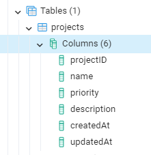

En la imagen observamos que al final se crean dos propiedades que no tenemos en nuestro esquema, esas se crean automaticamente, pero si no queremos que se visualicen podemos hacer lo siguiente --> creamos otro objeto debajo de nuestro esquema de Project timestamps:false, y el no las creara, pero en el index.js en sequelize.sync() tenemos que añadir lo siguiente --> (leer documentacion de sync) sequelize.sync({force:true}) para que borre la tabla y la actualice.

```
const server = require("../src/app");
const project = require("../src/models/Project");

require("dotenv").config();
const sequelize = require("../src/database/database");
const port = process.env.PORT;

const main = async () => {
  try {
    await sequelize.authenticate();
    await sequelize.sync({ force: true });
    server.listen(port, () => {
      console.log(`use port ${port}`);
    });
    console.log("Connection has been established successfully.");
  } catch (error) {
    console.error("Unable to connect to the database:", error);
  }
};

main();
```

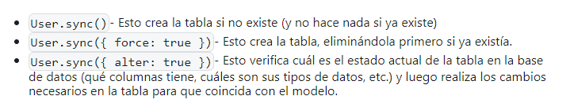

**Crearemos ahora el esquema para task**

```
const { DataTypes } = require("sequelize");
const sequilize = require("../database/database");

const Task = sequilize.define(
  "tasks",
  {
    taskID: {
      type: DataTypes.INTEGER,
      primaryKey: true,
      autoIncrement: true,
    },
    name: {
      type: DataTypes.STRING,
    },
    done: {
      type: DataTypes.BOOLEAN,
      defaultValue: false,
    },
  },
  {
    timestamps: false,
  }
);

module.exports = Task;
```

Observamos en pgAdmin y vemos que se crearon las tablas

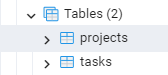

**Con todo esto tenemos las tablas creadas pero necesito realizar la relacion de uno a muchos**

Esta relacion la hacemos en Project.js

```
/*
hasMany --> un proyecto tiene muchas tareas
y le decimos que el foreignkey se llamara en task projectID
adicional que viene de projectID de projects
*/

Project.hasMany(Task, {
  foreignKey: "projectID",
  sourceKey: "projectID",
});

/*
ahora crearemos a donde pertenece tareas

Task.belongsTo(Project,{
   foreignKey: "projectID",
    targetID: "projectID",

    como esta es la tabla que va a estar enlazandoce
    en la tabla padre colocamos targetID
})
*/

Task.belongsTo(Project, {
  foreignKey: "projectID",
  targetId: "projectID",
});

module.exports = Project;
```

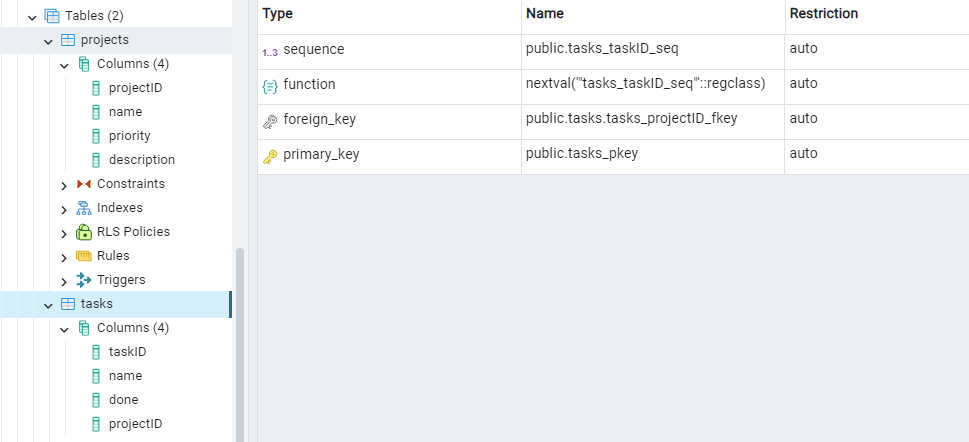

**Nota:** -->En el procedimiento anterior obligamos a crear las tablas directamente desde el index.js pero no es la idea, a continuacion veremos como se debe hacer.

**14.** Crearemos las rutas del proyecto

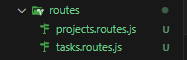

En la ruta creada projects.routes.js creamos lo siguiente:

```
const Router = require("express");

const router = Router();

//definimos las rutas

router.get("/projects"); //obtener
router.post("/projects"); //crear
router.put("/projects/:id"); //actualizar un solo proyecto
router.delete("/projects/:id"); //eliminar un solo proyecto
router.get("/projects/:id"); // obtener un solo proyecto

module.exports = router;
```

- Despues podemos empezar a importarlos, nos dirigimos a app.js

- Nota --> cada vez que damos en guardar en VS en las tablas se genera un DROPE, borra y crea las tablas entonces para que no haga eso vamos a hacer lo siguiente:

Eliminaremos las importaciones de los modulos y en sequilize.sync lo dejamos en false en el index.js. Esto lo vamos a ir cambiando a medida que vamos desarrollando.

```
const server = require("../src/app");

require("dotenv").config();
const sequelize = require("../src/database/database");
const port = process.env.PORT;

const main = async () => {
  try {
    await sequelize.authenticate();
    await sequelize.sync({ force: false });
    server.listen(port, () => {
      console.log(`use port ${port}`);
    });
    console.log("Connection has been established successfully.");
  } catch (error) {
    console.error("Unable to connect to the database:", error);
  }
};

main();
```

Ahora para seguir con las rutas y probarlas, nos toca meterle algo de lógica, en este caso vamos a crear los controllers. Crearemos dentro de la carpeta projects.controller.js y tasks.controller.js

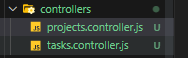

- Dentro del archivo projects.controller.js

```
const getProject = (req, res) => {
  res.send("getting projects");
};

const createProject = (req, res) => {
  res.send("creating projects");
};

module.exports.getProjects = getProjects;
module.exports.createProject = createProject;
```

Este controller lo importaremos en la ruta projects.route.js

```
const express = require("express");
const router = express.Router();

const { getProjects, createProject } = require("../controllers/projects.controller");

//definimos las rutas

router.get("/projects", getProjects); //obtener
router.post("/projects", createProject); //crear
router.put("/projects/:id"); //actualizar un solo proyecto
router.delete("/projects/:id"); //eliminar un solo proyecto
router.get("/projects/:id"); // obtener un solo proyecto

module.exports = router;
```

- Probaremos las rutas con postman

Realizaremos la peticion get a la ruta http//localhost:3000/projects

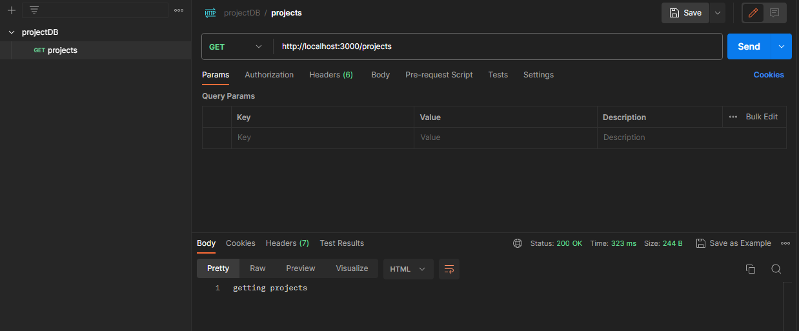

me da respuesta getting projects

y si realizo una peticion post, me da creating projects

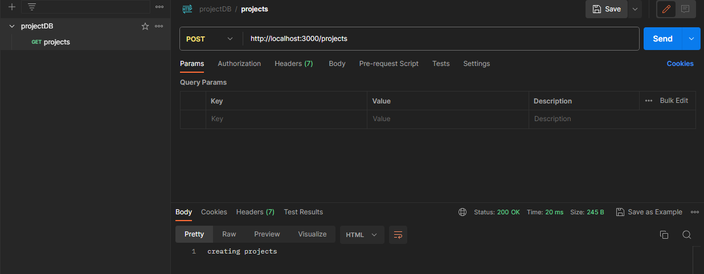

Con esto sabemos que estan funcionando las rutas, ahora tenemos que enviarle datos. Empezaremos con createProject por que necesitamos crear algo.

- Nos dirigimos a app.js, y tenemos que definir unos middlewares para recibir antes de crear.

```
const express = require("express");
const projectsRoutes = require("./routes/projects.routes");

const app = express();

//middlewares

app.use(express.json());
/*con la linea anterior vamos a decirle a express que use un middleware
llamado json.  Esta linea va a permitir que cada vez que se envie un
dato en formato json el servidor va a poder interpretarlo y lo va a guardar
dentro de un req.body
*/

app.use(projectsRoutes);

module.exports = app;
```

- Nos dirigimos ahora a projects.controller.js y trabajaremos con la funcion createProject

```
const getProjects = (req, res) => {
  res.send("getting projects");
};

const createProject = (req, res) => {
  console.log(req.body);
  res.send("creating projects");
};

module.exports.getProjects = getProjects;
module.exports.createProject = createProject;
```

- Revisando el postman con la peticion post se crea en body el objeto a enviar de projects. y nos da respuesta en consola.

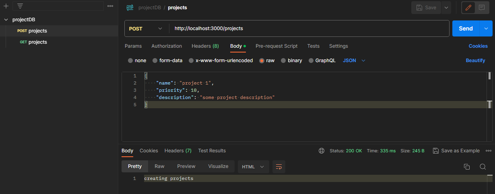

```
[nodemon] restarting due to changes...
[nodemon] starting `node src/index.js`
Executing (default): SELECT 1+1 AS result
Executing (default): SELECT 1+1 AS result
Connection has been established successfully.
use port 3000
{}
{}
{
  name: 'project 1',
  priority: 10,
  description: 'some project description'
}
```

- Aqui nos muestra que lo recibio y podre guardarlos.
  Para guardarlos tengo que importar mi modelo en el controller

```
const Project = require("../models/Project");
/*con la importacion de este modelo ya se puede ejecutar consultas
de crear datos
*/
const getProjects = (req, res) => {
  res.send("getting projects");
};

const createProject = async (req, res) => {
  console.log(req.body);
  const { name, priority, description } = req.body;
  const newProject = await Project.create({
    name: name,
    priority: priority,
    description: description,
  });
  console.log(newProject);
  res.send("creating projects");
};

module.exports.getProjects = getProjects;
module.exports.createProject = createProject;
```

- Se gener auna respuesta y lo podemos ver tanto en postgres como en la consola, en dataValues.

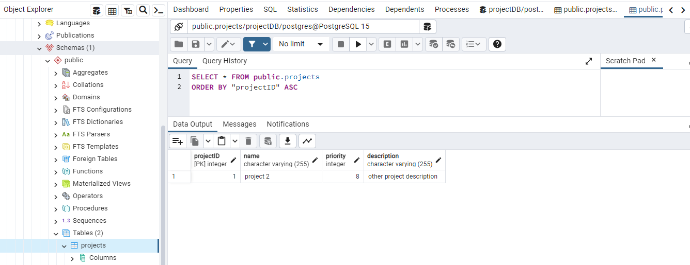

```
projects {
  dataValues: {
    projectID: 1,
    name: 'project 2',
    priority: 8,
    description: 'other project description'
  },}

```

- Se observa que se agrego a la base de datos con el metodo POST.

**Ahora si queremos ver los datos nos vamos a getProjects**

```
const Project = require("../models/Project");
/*con la importacion de este modelo ya se puede ejecutar consultas
de crear datos
*/

// Ver datos
const getProjects = async (req, res) => {
  const projects = await Project.findAll();
  //El findALL de todas las filas las recorre y forma un arreglo.

  console.log(projects);

  res.json(projects);
  /* en el res.json, dice que va a enviar un json y vas a mostrar este
  arreglo de proyectos. */
};

//Crear Datos
const createProject = async (req, res) => {
  console.log(req.body);
  const { name, priority, description } = req.body;
  const newProject = await Project.create({
    name: name,
    priority: priority,
    description: description,
  });
  console.log(newProject);
  res.send("creating projects");
};

module.exports.getProjects = getProjects;
module.exports.createProject = createProject;
```

- Observamos en postman como se ve la consulta en json.

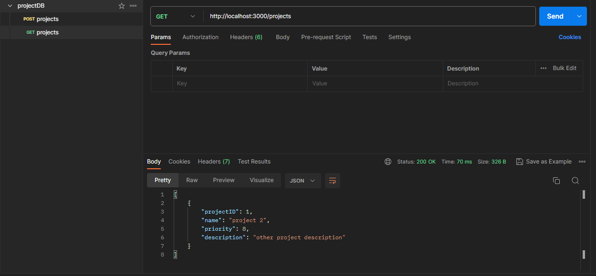

- Algo importante es como visualizar los errores en una peticion, vamos a usar try catch en los controlller

```
const Project = require("../models/Project");
/*con la importacion de este modelo ya se puede ejecutar consultas
de crear datos
*/

// Ver datos
const getProjects = async (req, res) => {
  try {
    throw new Error("error get");
    const projects = await Project.findAll();
    //El findALL de todas las filas las recorre y forma un arreglo.

    console.log(projects);

    res.json(projects);
    /* en el res.json, dice que va a enviar un json y vas a mostrar este
        arreglo de proyectos. */
  } catch (error) {
    return res.status(500).json({ message: error.message });
  }
};

//Crear Datos
const createProject = async (req, res) => {
  try {
    console.log(req.body);
    const { name, priority, description } = req.body;
    const newProject = await Project.create({
      name: name,
      priority: priority,
      description: description,
    });
    console.log(newProject);
    res.json(newProject);
  } catch (error) {
    return res.status(500).json({ message: error.message });
  }
};

module.exports.getProjects = getProjects;
module.exports.createProject = createProject;
```

- El throw new Erro("Error get) es para probar si hay un error pero se deja comentado. El error lo podemos ver en postman.

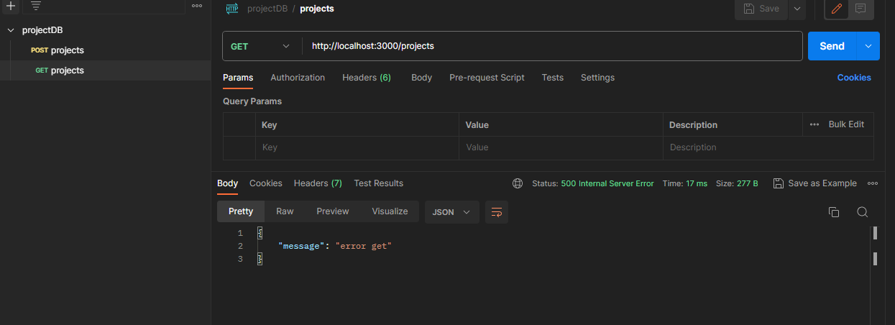
